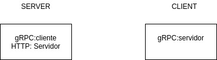

INSTALACION PROTOC: https://grpc.io/docs/protoc-installation/
$ apt install -y protobuf-compiler
$ protoc --version 

CREAR PROYECTO GO: https://grpc.io/docs/languages/go/quickstart/
$ go mod init cliente

Para compilar Protocol:
$ export GO111MODULE=on  
$ go get google.golang.org/protobuf/cmd/protoc-gen-go google.golang.org/grpc/cmd/protoc-gen-go-grpc

Update:
$ export PATH="$PATH:$(go env GOPATH)/bin"

En la carpeta client:
$ go run grpc-client/client.go

